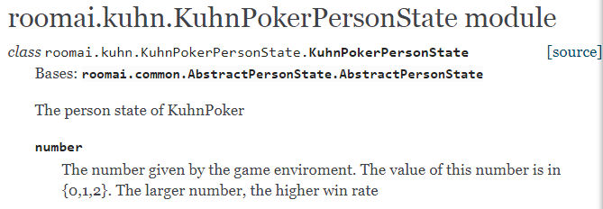

# Guides for AI Developers

Before read this, please read the [tutorial](tutorials.md).

This is some guides for the people, who want to develop some AI bots. To develop an AI bot is
 to implement a player class with your strategy. There are some common steps of developing AI bots.
 
 - [step 1: Choose a Game and Work out a Strategy](step-1-choose-a-game-work-out-a-strategy)
 - [step 2: Access the State of the Game](step-2-access-the-state-of-the-game)
 - [step 3: Implement the AI Player](step-3-write-the-code)
 
#### Step 1: Choose a Game and Work out a Strategy

The first step of developing an AI bot is to choose a game and work out a strategy.  We choose Kuhn Poker for the example, and the extensive form of Kuhn Poker is shown as follows.

1. The chance player deals one of 0,1,2 to player 0.
1. The chance player deals one of the rest numbers to player1.
1. Player 0 can check or bet.
    1. If player 0 checks then player 1 can check or bet. 
        1.  If player 1 checks there is a showdown (i.e. the higher number wins 1 from the other player).
        1.  If player 1 bets then player 0 can check or bet.
            1.  If player 0 checks then player 1 wins 1 from player 0.
            1.  If player 0 bets there is a showdown (i.e. the higher number wins 2 from the other player).
    1.  If player 0 bets then player 1 can check or bet.
        1.  If player 1 checks then player 0 wins 1 from player 1.
        1.  If player 1 bets there is a showdown (i.e. the higher number wins 2 from the other player).

We needn't be concerned with the chance player, and pay attention to the AI player. The AI player may be Player 0 or Player 1.
We work out an aggressive strategy for Kuhn Poker: 

- If the number dealt to the AI player is 1 or 2, the AI player always choose the "bet" action; 
- if the number dealt to the AI player is 0, the AI player always choose "check" action.

#### Step 2: Access the State of the Game

To implement the above strategy, the AI player need know the number dealt to it. We can lookup the [API doc](http://roomai.readthedocs.io/en/latest/index.html) for the number.
The number dealt to the player is known by this player and hidden from other players, hence we search the person state.
In the API doc, the descriptions of the KuhnPokerPersonState is shown as follows.

So, we can get the number using the property info.person_state.number. 

#### Step 3: Implement the AI Player

We implement an AI player with the above strategy. The AI player must extends roomai.common.AbstractPlayer, and implement three functions: receive_info, take_action and reset.

<pre>
class ExamplePlayer(roomai.common.AbstractPlayer):
    def receive_info(self, info):
        self.number = info.person_state.number 
        ### info.person_state.number is the number dealt to the player. 
        ### We know this by the step 2
            
    def take_action(self):
        if self.number >= 1:
            return roomai.kuhn.KuhnPokerAction.lookup("bet")
        else:
            return roomai.kuhn.KuhnPokerAction.lookup("check")
        
    def reset(self):
        pass
        
</pre>

We can test this AI player with the random player.

<pre>
players        = [AggressiveKuhnPlayer()] + [roomai.common.RandomPlayer()] + [roomai.common.RandomPlayerChance()]
players_random = [roomai.common.RandomPlayer() for i in range(2)] + [roomai.common.RandomPlayerChance()]
env = roomai.kuhn.KuhnPokerEnv()

total_scores = [0,0]
total_scores_random = [0,0]
for i in range(10000):
    scores = roomai.kuhn.KuhnPokerEnv.compete(env, players)
    total_scores[0] += scores[0]
    total_scores[1] += scores[1]

    scores = roomai.kuhn.KuhnPokerEnv.compete(env, players_random)
    total_scores_random[0] += scores[0]
    total_scores_random[1] += scores[1]

total_scores = [s/10000 for s in total_scores]
total_scores_random = [s/10000 for s in total_scores_random]
print ("aggressive vs random",total_scores)
print ("random_vs_random",total_scores_random)
</pre>

Run the above code, we get 
<pre>
aggressive_vs_random [0.2666, -0.2666]
random_vs_random [-0.0055, 0.0055]
</pre>
This means the aggressive strategy is a litte better than the random strategy. The code of this example is shown [here](../../example/aggressive_kuhn.py).

