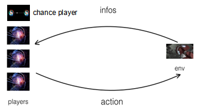

#  RoomAI Tutorials

There are some basic concepts in RoomAI: Player, Environment, Information and Action. The basic procedure of a competition is shown as follows. All players receive information from env, the current player takes a action, and the environment forwards with this action.

<pre>

#!/bin/python
#coding:utf-8
from roomai.kuhn import *;
import random
import roomai
import roomai.common

class KuhnPokerExamplePlayer(roomai.common.AbstractPlayer):
    def receive_info(self, info):
        if info.person_state.available_actions is not None:
            self.available_actions = info.person_state.available_actions
            
    def take_action(self):
        values = self.available_actions.values()
        return list(values)[int(random.random() * len(values))]
        
    def reset(self):
        pass
        
def compete(env, players):
   '''
   :param env: the game environments
   :param players: the array of players, the last player is a chance player.
   :return: the final scores of this competition
   '''
   
   for player in players:
        player.reset()
   params = dict()
   params["param_num_normal_players"] = len(players) - 1
   #len(players)-1 normal players and 1 chance player
   
   infos, public_state, person_states, private_state = env.init(params)
   for i in range(len(players)):
       players[i].receive_info(infos[i])

   while public_state.is_terminal == False:
        turn = public_state.turn
        action = players[turn].take_action()
        
        infos, public_state, person_states, private_state = env.forward(action)
        for i in range(len(players)):
            players[i].receive_info(infos[i])

   return public_state.scores 

if __name__ == "__main__":
        players = [KuhnPokerExamplePlayer() for i in range(2)] + [roomai.common.RandomPlayerChance()]
        #RandomChancePlayer is the chance player with the uniform distribution over every output
        env = KuhnPokerEnv()
        scores = compete(env, players) 
        ### The environment class has the static compete function. 
        ### The above code can be changed with "KuhnPokerEnv.compete(env,players)"
        ### Here, we defines the compete function to make the details clear to readers.
        print (scores)            
</pre>

We define these basic concepts as classes in the [common package](https://github.com/roomai/RoomAI/blob/master/roomai/common), and all corresponding classes of specific games, i.e. the action class in the Bridge game, must extend them.  

#### 1. Information

Information is sent by the game environment to the players, and is the only way for the normal and chance players to access the states of the game environment. The information is in the class Info, and the class Info is consisted of the public state and the person state. 

1. The public state is available for all players.

2. A person state is corresponding to a player. The person state is available for the corresponding player and hidden from other players. 

3. The private state is not in Info, and hidden from all players.

<pre>

class AbstractPrivateState:
    pass
    
class AbstractPublicState:
    turn             = 0
    ## players[turn] is expected to take an action
    ## for example, turn = 0 means the players[0] is expected to take an action
    ## default turn is 0

    action_history   = []
    ## The action_history records all actions taken by all players so far.
    ## The format of record item in action_history is (player_id, action) 
    ## For example, action_history = [(0, roomai.kuhn.KuhnAction.lookup("check"),\
                                      (1,roomai.kuhn.KuhnAction.lookup("bet")]
    ## default action_history is []
    
    
    ## Parameters
    ## The attributes with "param" prefix are parameters, which are set in the init function of the environment with the params dict
    self.param_start_turn            = 0
    self.param_num_normal_players    = 2
    self.param_backward_enable       = False
    
    
    self.is_terminal = False
    self.scores      = None
    ## when is_terminal = true,  scores = [float0, ..., float_n] are scores for player0,..., player_n.
    ## when is_terminal = false, scores = None
    ## default is_terminal is False.

class AbstractPersonState:
    id                = None
    ## id = 0 means the player receiving this person state is players[0]

    available_actions = dict()
    ## If the corresponding player is expected to take a action,
    ## then available_actions is a dict with (action_key, action)
    ## Otherwise, available_actions is the empty dict.

class Info:
    public_state
    person_state
</pre>

The Infos sent to different players are different. They contain the same public state and different person states. The private_state isn't in any Info, hence no player can access it.

#### 2. Player

We implemented games in RoomAI in the [extensive form game](https://en.wikipedia.org/wiki/Extensive-form_game). The extensive form games add the nature as the chance player, so that the players in the extensive form game can be categorized into two types: the normal player and the
chance player. The normal player acts as the AI or one of human to play the games. The chance player is a fictitious player, who generates the random events in the game. For example, the chance player decides the hand cards of three players in DouDiZhu.

<pre>
class AbstractPlayer:
    def receive_info(self,info):
        raise NotImplementedError("The receiveInfo function hasn't been implemented") 

    def take_action(self):
        raise NotImplementedError("The takeAction function hasn't been implemented") 

    def reset(self):
        raise NotImplementedError("The reset function hasn't been implemented")
        
class AbstractPlayerChance:
    '''
    The chance player 
    '''
    def receive_info(self,info):
        raise NotImplementedError("The receiveInfo function hasn't been implemented") 

    def take_action(self):
        raise NotImplementedError("The takeAction function hasn't been implemented") 

    def reset(self):
        raise NotImplementedError("The reset function hasn't been implemented")
</pre>

In default, the chance player has the uniform distribution over the chance events. We have implemented the class RandomChancePlayer, which acts as the default chance player.
<pre> 
class RandomPlayerChance(AbstractPlayer):
    '''
    The RandomChancePlayer is a chance player, who randomly takes an chance action.
    '''
    def receive_info(self, info):
        self.available_actions = info.person_state.available_actions

    def take_action(self):
        import random
        idx = int(random.random() * len(self.available_actions))
        return list(self.available_actions.values())[idx]

    def reset(self):
        pass
   
</pre>

To develop an AI-bot, you should extend this AbstractPlayer and implement the receive_info, take_action and reset function.

#### 3. Action

The player takes a action, and the game environment forwards with this action. The action in RoomAI can be categorized in two two types: the normal action and the chance action. The chance action is used by the chance player.

<pre>
class AbstractAction:
    @classmethod
    def lookup(self, key):
        raise NotImplementedError("The lookup function hasn't been implemented")

class AbstractChanceAction:
    @classmethod
    def lookup(self,key):
        raise NotImplementedError("The lookup function hasn't been implemented")

</pre>

#### 4. Enviroment

Enviroment is a environment of a game.

<pre>
class AbstractEnv:

    def init(self, params = dict()):
        '''
        Init the game environment

        :param: params for the game initialization. \n
        1. "param_num_normal_players" denotes how many normal players are in this game. \n
        2. "backward_enable" enables users to use the backward function. Default False. \n
        An example of params is {"param_num_normal_players":3, "backward_enable":True}
        :return: infos, public_state, person_states, private_state
        '''
        raise NotImplementedError("The init function hasn't been implemented")

    def forward(self, action):
        '''
        :return:infos, public_state, person_states, private_state
        '''
        raise NotImplementedError("The forward function hasn't been implemented")

    def backward(self):
        '''
        The game goes back to the previous states.
        To use the backward, you need to set "backward_enable" option to be true when initialize the game.
        
        :return:infos, public_state, person_states, private_state 
        '''
        The backward function has been implemented in this abstract Env.

    def forward_able(self):
        '''
        The function returns a boolean variable, which denotes whether we can call the forward function. 
        At the end of the game, we can't call the forward function any more.

        :return: A boolean variable denotes whether we can call the forward function.
        '''
        The forward_able function has been implemented in this abstract Env.

    def backward_able(self):
        '''
        The function returns a boolean variable denotes whether we can call the backward function. 
        If the game environment goes back to the initialization, we can't call the backward function any more.

        :return: A boolean variable denotes whether we can call the backward function.
        '''
        The backward_able function has been implemented in this abstract Env.

    #########  Some Utils Function #########
    @classmethod
    def compete(cls, env, players):
        '''
        holds a competition for the players, and computes the scores.
        '''
        raise NotImplementedError("The compete function hasn't been implemented")

    @classmethod
    def available_actions(cls, public_state, person_state):
        '''
        :return all available_actions
        '''
        raise NotImplementedError("The available_actions function hasn't been implemented")

</pre>

If you want to develop an AI-bot for a particular game, you need to know the details of this game.
For example,  if you want to deveop an AI for TexasHoldem, you need to know where to find your hand cards.
You can find the in [API doc](http://roomai.readthedocs.io/en/latest/?badge=latest).

